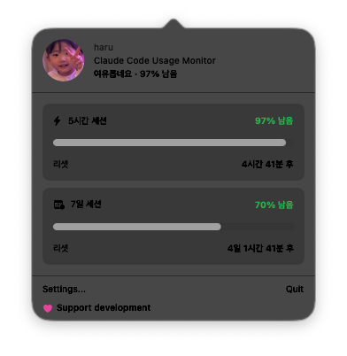

# haru

A macOS menu bar app that monitors your Claude Code usage in real-time.

## Features

- **Rate Limit Monitoring** — Track 5-hour and 7-day usage limits from your menu bar
- **Custom Face Icon** — Use your face photo as the menu bar icon, with visual effects that change based on usage level
- **Bilingual** — Korean and English supported

## Screenshot



## Installation

### Homebrew

```bash
brew install --cask JuyeonYu/haru/haru
```

### Build from Source

```bash
git clone https://github.com/JuyeonYu/haru.git
cd haru
open ccmaxok/ccmaxok.xcodeproj
```

Build and run in Xcode. The app icon will appear in your menu bar.

## Requirements

- macOS 15.0+
- [Claude Code](https://docs.anthropic.com/en/docs/claude-code) (Max or Pro plan)

## How it Works

1. Integrates with Claude Code's statusline hook to collect usage data
2. Displays remaining rate limits in real-time on the menu bar
3. Shows usage status at a glance through the popover panel

## Tech Stack

- Swift / SwiftUI
- SQLite ([SQLite.swift](https://github.com/stephencelis/SQLite.swift))
- Vision framework (face detection)

## Support

If you find haru useful, consider [supporting development](https://github.com/sponsors/JuyeonYu?frequency=one-time&amount=5).

## License

[MIT](LICENSE)
